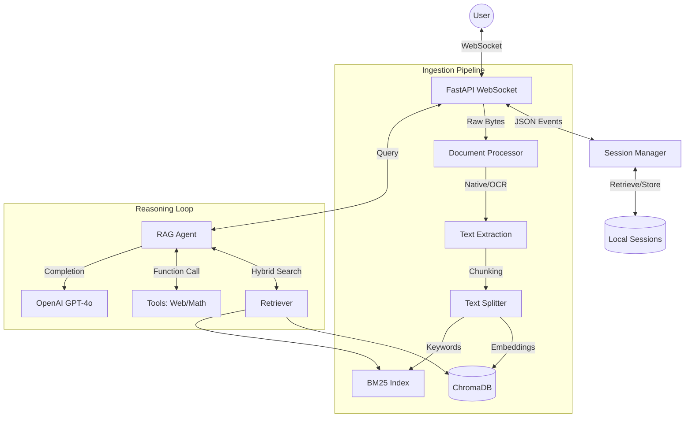

# 🤖 Query Bot: Agentic RAG Chatbot

Query Bot is a high-performance, real-time AI assistant built with **FastAPI**, **LangChain**, and **OpenAI**. It specializes in **Retrieval-Augmented Generation (RAG)**, allowing users to upload documents and query them using an agentic workflow that can also browse the web and perform calculations.


---

## 🌟 Key Features

### 🔍 Advanced Retrieval System
- **Hybrid Search**: Combines semantic vector search (**ChromaDB**) with traditional keyword search (**BM25**) using a reciprocal rank fusion approach.
- **Dynamic Context Injection**: Automatically injects relevant document snippets into the LLM's prompt based on the user's query.

### 📄 Sophisticated Ingestion
- **OCR Integration**: Uses **Tesseract OCR** and **pdf2image** to extract text from scanned PDFs that lack a text layer.
- **Smart Chunking**: Implements `RecursiveCharacterTextSplitter` with configurable chunk sizes and overlaps for optimal context preservation.
- **Multilingual Support**: Supports multiple text encodings (UTF-8, Latin-1, etc.) for robust document parsing.

### 🛠️ Agentic Capabilities
- **Autonomous Reasoning**: The agent (powered by GPT-4o) evaluates whether the document context is sufficient or if it needs to use external tools.
- **Web Search**: Integrated via Serper API for real-time information retrieval.
- **Calculator**: A precise tool for handling mathematical queries that LLMs might struggle with.

### ⚡ Real-time Experience
- **WebSocket Communication**: Tokens are streamed to the frontend as they are generated, providing a "typing" effect.
- **Progress Tracking**: Real-time progress bars for document uploads and indexing.

---

## 🏗️ Technical Architecture

### Backend Stack
- **Web Framework**: FastAPI (Asynchronous)
- **Orchestration**: LangChain (Expression Language)
- **Vector Store**: ChromaDB (On-disk persistence)
- **LLM**: OpenAI GPT-4o / GPT-4o-mini
- **Embeddings**: OpenAI `text-embedding-3-small`

### Why I am using
## 🚀 1. Backend Framework — FastAPI
**Role:** Core API layer and async runtime  

**Why this choice:**
- Handles LLM streaming responses  
- Supports concurrent embedding and API calls  
- Non-blocking, high-performance architecture  

**Built-in advantages:**
- Automatic request validation (Pydantic)  
- Strong type safety  
- Predictable API behavior  

---

## 🔄 2. Communication Layer — WebSocket
**Role:** Real-time bidirectional communication  

**Why this design:**
- Token-level streaming responses  
- Real-time document upload progress  
- Persistent connection (no reconnects)  
- Session continuity using `session_id`  

👉 One connection handles chat, upload, and session management  

---

## 🤖 3. LLM — OpenAI GPT-4o
**Role:** Core reasoning and response engine  

**Why this choice:**
- Strong tool/function-calling capability  
- Reliable instruction following  
- Handles multi-step reasoning (RAG + tools)  

**Dynamic behavior:**
- Answers directly  
- Retrieves document context  
- Calls tools (web search, calculator)  

👉 Eliminates rigid rule-based routing  

---

## 🧩 4. Agent Orchestration — LangGraph
**Role:** Controls reasoning flow and tool execution  

**Execution Flow:**
User → Retrieval → LLM → Tool → LLM → Response

**Why this choice:**
- Transparent execution (debuggable)  
- Modular node-based design  
- Easy to extend (validator, routing, memory)  

---

## 🗄️ 5. Vector Store — ChromaDB
**Role:** Stores and retrieves embeddings  

**Why this choice:**
- Embedded database (no external setup)  
- Persistent storage  
- Fast similarity search  

👉 Can be replaced with Pinecone or Weaviate  

---

## 🔢 6. Embeddings — text-embedding-3-small
**Role:** Converts text into semantic vectors  

**Why this choice:**
- Strong semantic understanding  
- Cost-efficient  
- Optimized for RAG pipelines  

---

## 🔍 7. Hybrid Retrieval — BM25 + Vector Search
**Role:** Improves retrieval accuracy  

**Approach:**
- Dense retrieval → semantic meaning  
- Sparse retrieval (BM25) → exact matches  

**Benefits:**
- Better recall for IDs, keywords, and codes  
- Higher overall relevance  

---

## 🌐 8. Web Search — Serper API
**Role:** Provides real-time external knowledge  

**Why this choice:**
- Google-quality search results  
- Includes answer boxes and knowledge graphs  
- Supports full content retrieval  

**Used when:**
- Information is time-sensitive  
- Internal knowledge is insufficient  

---

## 📄 9. Document Processing — PDF Pipeline

**Components:**
- pypdf  
- pdf2image  
- pytesseract  

**Processing Strategy:**
1. Native text extraction (fast)  
2. OCR fallback (for scanned PDFs)  

**Outcome:**
- Supports both digital and scanned documents  

---

# ⚙️ System Design Overview

The system follows a hybrid agentic RAG architecture:

User Query
   ↓
Intent Handling
   ↓
Hybrid Retrieval (BM25 + Vector DB)
   ↓
LLM Reasoning (GPT-4o)
   ↓
Tool Usage (Web Search / Calculator)
   ↓
Streaming Response via WebSocket

### Project Structure
```text
Query_Bot/
├── app/
│   ├── agents/           # RAGAgent and Tool binding logic
│   ├── api/              # WebSocket handlers and event dispatchers
│   ├── core/             # Configuration, dependencies, and session management
│   ├── knowledge_base/   # Document processing, VectorStore, and HybridRetriever
│   ├── models/           # Pydantic schemas for API and internal data
│   ├── tools/            # WebSearch and Calculator implementations
│   └── validators/       # AI-driven response quality assessment
├── frontend/             # Premium Glassmorphism UI (Static Files)
├── chroma_db/            # Persistent storage for embeddings
├── sessions/             # Local history for chat persistence
└── main.py               # Application entry point
```

---

## ⚙️ Configuration (.env)

| Variable | Description | Default |
| :--- | :--- | :--- |
| `OPENAI_API_KEY` | Your OpenAI API Key (**Required**) | - |
| `OPENAI_MODEL` | The LLM model to use | `gpt-4o` |
| `SERPER_API_KEY` | Key for web search tool (Optional) | `""` |
| `CHUNK_SIZE` | Size of document chunks | `700` |
| `CHUNK_OVERLAP` | Overlap between chunks | `100` |
| `RETRIEVAL_TOP_K` | Number of chunks to retrieve | `5` |

---

## 🔌 WebSocket Protocol

Query Bot communicates via a single WebSocket endpoint at `/ws/main`.

### Client to Server Messages
```json
{ "type": "chat", "message": "What is in the document?", "session_id": "uuid" }
{ "type": "upload", "filename": "data.pdf", "data": "base64_string" }
{ "type": "sessions_list" }
{ "type": "session_load", "session_id": "uuid" }
```

### Server to Client Events
- `chat_token`: Individual tokens for streaming.
- `chat_done`: Signals the end of a response with a quality verdict.
- `upload_start/page_done/upload_complete`: Progress updates for ingestion.
- `search_web/use_calculator`: Notifies the UI that the agent is using a tool.

---

## 📥 Installation & Setup

### 1. Prerequisites
- Python 3.10+
- **Tesseract OCR**: Required for scanned PDF support.
  - *Windows*: [Download Installer](https://github.com/UB-Mannheim/tesseract/wiki)
  - *Linux*: `sudo apt install tesseract-ocr`

### 2. Environment Setup
```bash
# Clone and enter directory
git clone https://github.com/your-repo/Query_Bot.git
cd Query_Bot

# Create and activate venv
python -m venv venv
source venv/bin/activate  # Or venv\Scripts\activate on Windows

# Install dependencies
pip install -r requirements.txt
```

### 3. Start the Server through UI
```bash
python main.py or uvicorn main:app --port 8080 --reload
```
Open `http://localhost:8080` in your browser.

### 3. Start the Server through FastAPI
```bash
python chat_sever.py or uvicorn chat_server:app --reload
```
Open `http://localhost:8000` in your browser.


---

## 📐 System Architecture

### High-Level Architecture
Query Bot follows a modern asynchronous architecture with a decoupled frontend and an agent-driven backend.



### 🔄 Data Flow (Input ➔ Output)

#### 1. Ingestion Flow
1. **Input**: User uploads a file (PDF/TXT) via the UI.
2. **Transfer**: File is sent as a Base64 string over WebSocket.
3. **Processing**: 
   - `pypdf` extracts text natively.
   - If empty, **Tesseract OCR** processes the image layer.
4. **Storage**: Text is split into 700-character chunks. ChromaDB stores vector embeddings, while a local BM25 index is built for keyword parity.
5. **Output**: Success event sent to UI, document is now "searchable".

#### 2. Query Flow
1. **Input**: User sends a natural language question.
2. **Context**: The `HybridRetriever` pulls the top-K most relevant chunks using both Vector and BM25 scores.
3. **Reasoning**: The LLM analyzes the chunks. If it needs more data, it calls the `WebSearchTool`.
4. **Streaming**: As the LLM generates the answer, tokens are dispatched immediately via WebSocket.
5. **Validation**: The `ResponseValidator` checks the final output for hallucinations or low confidence.
6. **Output**: Final tokens + confidence verdict displayed to the user.

---

## 🎯 Use Cases

- **📄 Research Assistant**: Upload dense academic papers and ask for summaries or specific methodology details..
- **🛠️ Technical Support**: Feed product manuals into the bot to create an instant searchable help desk for customers.
- **🕵️ Data Fact-Checking**: Use the Agent's web search capability to verify claims found within uploaded internal documents.

---

## ❓ Troubleshooting

**`ModuleNotFoundError: No module named 'langchain_core'`**
> Ensure you have installed all requirements: `pip install -r requirements.txt`. If issues persist, run `pip install langchain-core langchain-openai`.

**`ModuleNotFoundError: No module named 'pydantic_settings'`**
> Run `pip install pydantic-settings` to fix missing environment configuration dependencies.

**OCR not working for PDFs**
> Ensure `tesseract` is in your system PATH. On Windows, you may need to specify the path in `app/knowledge_base/ingestion.py` or ensure the installer added it to the environment variables.

**Vector DB Connection Errors**
> Delete the `chroma_db/` folder and restart the application to re-initialize the database.

---
